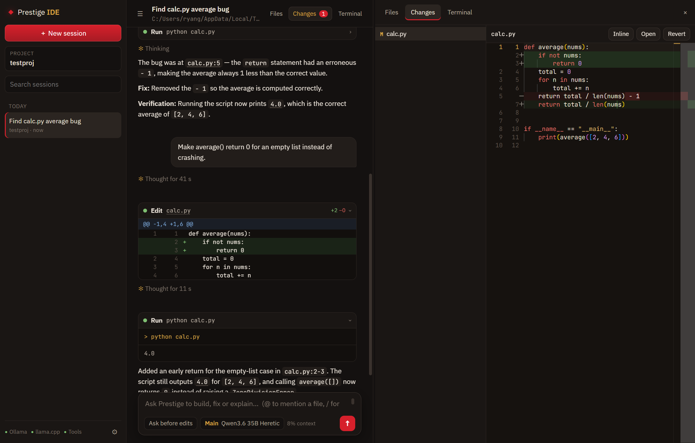

<p align="center">
  
</p>

<h1 align="center">Prestige IDE</h1>

<p align="center">
  <b>An agentic coding IDE that runs on your own models.</b><br>
  Ask it to build, fix or explain. It reads your code, edits files, runs PowerShell and checks its work,<br>
  all on your PC through the <a href="https://github.com/Mr5elfDe5truct/custom-ai-workstation">Custom AI Workstation</a>. No accounts, no cloud, no API keys.
</p>

<p align="center">
  
  
  
  <br>
  
  
  
  
  
  
</p>

---

## 🧭 What it does

| | Feature | How |
|---|---|---|
| 🤖 | **Agent loop** | The model calls tools (read, write, edit, list, glob, grep, run PowerShell, todo list, web search and fetch), sees the results and keeps going until the job is done, then says what it changed and how it checked it |
| 🛡️ | **Permission modes** | **Ask before edits** (default), **Accept edits**, **Plan mode** (read-only, ends with a plan you approve) and **Bypass**. Switch with **Shift+Tab**. Every edit and command shows first, with a diff; answer **1** yes, **2** yes and don't ask again for this command or for edits, **3** no, or type what to do instead |
| 🧾 | **Tool cards with diffs** | Each step is a card: edits show a unified diff with line numbers and +/− counts, commands show their output live as it runs, failures open themselves |
| 🔀 | **Changes pane** | Every file the session touched, diffed against how it was before the session (Monaco's diff editor, side by side or inline), with **Revert** |
| 📝 | **Files pane** | Folder tree (respects .gitignore) and Monaco editor tabs: syntax colouring, minimap, Ctrl+S to save. Files the agent changes reload on their own unless you have unsaved edits. Right-click a file to @-mention it |
| 💻 | **Terminal** | Real PowerShell terminals (ConPTY + xterm.js) in tabs, opened in the project folder |
| 🗂️ | **Sessions** | Every conversation saved on your PC, titled by the Mini model, grouped by date, searchable, pinnable, and resumable with its diffs and tool cards |
| 🎚️ | **Model tiers** | **Deep**, **Main**, **Fast** and **Mini**, each mapped to any Ollama or llama.cpp model in Settings; switch per session from the model chip. 🔓 marks uncensored models |
| 📎 | **@-mentions** | `@src/main.ts` attaches a file, `@src/main.ts:10-40` a range, `@src/` a folder listing, with autocomplete |
| ⌨️ | **Slash commands** | `/init` writes a PRESTIGE.md for the project · `/compact` summarises to free context · `/review` reviews uncommitted changes · `/commit` · `/plan` · `/rewind` · `/model` · `/clear` · `/help`, plus your own in `.prestige/commands/*.md` (`$ARGUMENTS` is replaced) |
| 📚 | **Project instructions** | `PRESTIGE.md`, `CLAUDE.md`, `AGENTS.md` or `.github/copilot-instructions.md` in the project root go into every prompt, with the git branch and status |
| 🧠 | **Context that lasts** | A context meter on the composer; at 80% the conversation is summarised automatically and the work carries on |
| 🧵 | **Message queue** | Type while it works: your message waits its turn. **Esc** stops, **↑** brings back your last message |
| 🔌 | **MCP tools** | Every MCP server on an mcpo endpoint (the Workstation's `:8200`: workstation scout, Playwright browser, time, files, desktop, and anything added from Prestige's tool store) becomes agent tools, switched per server in Settings. Read-only tools run freely; the rest ask first, with "don't ask again" per tool |
| ↺ | **Checkpoints and rewind** | Every message is a checkpoint. Hover it and **Rewind** (or `/rewind`) to put back every file the agent changed since, as it was then, drop the later turns and edit the message. It tells you which commands ran since, because their effects can't be undone |
| 🖼️ | **Pictures** | Paste, drop or attach screenshots and mockups for vision models (Qwen3.6 35B, Qwen3.8 27B and the other llama.cpp models here read them); resized to 1568 px |
| ✻ | **Thinking on/off** | Per session from the composer. Off answers straight away: the same bug fix took 40 s instead of about 2½ minutes on Qwen3.6 35B |
| 🧩 | **Text tool-call fallback** | Models that write `<tool_call>` or `<function=…>` into their reply instead of the tool field still work |

## 🖥️ Requirements

- **The [Custom AI Workstation](https://github.com/Mr5elfDe5truct/custom-ai-workstation)** running: Ollama on `:11434`, the
  llama.cpp router on `:8081`, and (for web search) the mcpo tool server on `:8200`. The dots at the bottom of the
  sidebar show which are up.
- A model that can call tools. Tested with **Qwen3.6 35B-A3B Heretic**: read → edit → run → verify, ~29 tok/s on an
  RTX 3060 12 GB once loaded.
- Windows 11 (WebView2 is built in).

See **[docs/MODELS.md](docs/MODELS.md)** for the model sweep: which uncensored models fit 12 GB + 6 GB cards and how
to map them to tiers. (Claude Opus, Sonnet, Haiku and Fable are not open-weight and can't run locally; that page explains
what the "Claude-distilled" fine-tunes on Hugging Face actually are.)

## 🛠️ Build from source

You need [Node.js](https://nodejs.org) LTS, [Rust](https://rustup.rs) (stable, MSVC) and
[Visual Studio 2022 Build Tools](https://visualstudio.microsoft.com/visual-cpp-build-tools/) with **Desktop development with C++**.

```powershell
git clone https://github.com/Mr5elfDe5truct/prestige-ide
cd prestige-ide
npm install
npm run tauri dev     # development window with hot reload
npm run tauri build   # installer in src-tauri\target\release\bundle\nsis\
```

## ⌨️ Keys

| Key | |
|---|---|
| Enter / Shift+Enter | send / new line |
| Shift+Tab | next permission mode |
| Esc | stop the agent |
| ↑ (empty box) | edit your last message |
| Ctrl+N | new session |
| Ctrl+B | sidebar |
| Ctrl+E / Ctrl+D / Ctrl+` | Files / Changes / Terminal |
| Ctrl+S (editor) | save |

## 🏗️ How it's built

| Part | What |
|---|---|
| `src/agent.ts` | the agent loop, system prompt (project instructions, git state), compaction, titles |
| `src/tools.ts` | tool schemas, permission rules and execution |
| `src/backends.ts` | streaming chat with tool calls for Ollama and llama.cpp, shared shape with Prestige |
| `src/ui/` | transcript and tool cards, Files (Monaco), Changes (Monaco diff), Terminal (xterm.js), settings |
| `src-tauri/` (Rust + Tauri 2) | file reading, writing, glob and grep with `ignore`/`globset`/`regex`, PowerShell runs with streamed output and stop, ConPTY terminals via `portable-pty`, sessions and settings in `%APPDATA%\com.rgstudios.prestige-ide` |

## 🔗 Part of the R.G. Studios stack

- **[Custom AI Workstation](https://github.com/Mr5elfDe5truct/custom-ai-workstation)**: the services and models
- **[Prestige](https://github.com/Mr5elfDe5truct/prestige)**: chat, voice, images, video and songs
- **Prestige IDE**: coding

## 📜 License

[MIT](LICENSE) © 2026 Ryan B. Gyles. Designed and built by Ryan B. Gyles · R.G. Studios. The models and apps it
connects to keep their own licenses.
